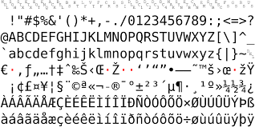

# outline

```{r setup, include=FALSE}
options(htmltools.dir.version = FALSE)
```

```{r xaringanthemer, include = FALSE}
library(xaringanthemer)
xaringanthemer::style_mono_accent(
  base_color = "#A70000",
  #  primary_color = "#A70000",
  #secondary_color = "#ff0000",
  white_color = "white",
  colors = c(
    red = "#A70000",
    purple = "#88398a",
    orange = "#ff8811",
    green = "#136f63",
    blue = "#4B4FFF",
    white = "#FFFFFF",
    black = "#181818"
  ),
  header_font_google = google_font("Roboto Condensed"),
  text_font_google   = google_font("Roboto Condensed", "300", "300i"),
  code_font_google   = google_font("Ubuntu Mono"),
  text_font_size = "30px",
  code_font_size = "30px",
  )
```


+ Overview to R and RStudio
+ Introduction to R
+ Starting with Data
+ Manipulating Data Frames with __dplyr__
+ Data visualisation

---
class: inverse, middle, center

# overview of R and RStudio

---
background-image: url("figs/chevron.png")
background-position: 98% 2%
background-size: 150px

## why learn `R`?

+ **_libre_ software**: free and free-to-be-used-and-modified for any means -> one of the pillars of open science

--

+ __script-based__: reproducibility, easy to scale up your analyses, transparency (track errors), great way to learn about methods.

--

+ __interdisciplinary and modular__: the code is written by the specialists. At the core of its philosophy is a smooth transition from user to programmer.

--

+ __communication__ with other tools: manuscripts, presentations, apps and dashboards

???
such as this presentation, made in __xaringan__

---
# why learn `R`?

+ communication with __other programming languages__ (ex. __reticulate__ to run python scripts) 

--

+ great __graphic capabilities__!

--


+ __official support__: help in documentation, mailing lists

--

+ __an active and welcoming community__:  email lists, Stack Overflow, [RStudio community](community.rstudio.com/), useR groups, .purple[R-Ladies+] chapters, Slack communities, `r icon::fa("twitter")` `#rstats`


---
## `R` has a modular structure: __packages__


+ `R` __base__ installation includes base packages developed and maintained by the __`R` Core Development Team__

--

+ other packages are created by the community

--

+ hosted in __CRAN__ (The Comprehensive `R` Archive Network) or Bioconductor, GitHub, rOpenSci.org

--

+ a package is a collection of functions, it must be loaded to be used (ex. `library(dplyr)`)

--

`r icon::fa("python")` the whole package is loaded, not some functions or parts of it. if you want to use one function you can use `package::function()`

---
class: inverse, middle, center

# let's take a look into RStudio

---
background-image:url("figs/00_rstudio.png")
background-size: 100%


---
background-image:url("figs/00_rstudio.png")
background-size: 100%


.pull-left[
### source (text editor)
]

.pull-right[
### *workspace*
<br>
<br>
<br>
<br>
<br>
<br>
<br>
<br>
<br>
### plots, file navigator etc.
]

.footnote[
<br>
### console
]
]

???
customizable 

---

+ Check for the following panes: 

  + Source -> Scripts and documents  
if you don't see it open a new script <kbd>`Ctrl`</kbd> + <kbd>`Shift`</kbd>+ <kbd>`N`</kbd> (a file with .R extension)
  + Environment -> Objects in the __workspace__
  + Files
  + Plots
  + Help
  + Console

Some other that might be useful _later_: 
  + __Terminal__
  + __Viewer__ (for presentations and documents)
  + __git__ (only when working inside an RStudio project)

---
## working directory

+ the __files__ pane is showing one folder location:

  + `Home/Documents`
  + `~/Documents`
  + `"/Users/andreasancheztapia/Documents"`

--

+ in `Global options > General > R Sessions`:
"default working directory when not in a project"

--

+ remember `pwd` in bash? in R: `getwd()` in the console


??? 

aqui interactuar por primera vez con rstudio

---
## working directory


+ we have to tell R where we are working -> change the working directory

--

+ every project should be executed in a single folder

--

+ it is also a good practice to create __reproducible__ analyses 

--

+ every computer is different, so how do we collaborate? `r emojifont::emoji("thinking")`


---
## absolute vs. relative paths

+ absolute paths  
  `C://My_Documents`
  `/users/my_name/` 

--

+ instead: __relative paths__
--

  + here: `.` or nothing (ex. `read.csv("data.csv")`)
  + subfolders: `./data_raw`
  + subsubfolder: `./subfolder1/subsubfolder1`
  + the upper level: `..`
  + a "sibling" folder (goes up one level and then down): `../sibling`

--

### relative file paths will be interpreted from the working directory

---
## project organization

+ projects are better organized if we use __subfolders__ within our working directory

+ __provenance__: we shouldn't modify __raw data files__ but __save processed data__ (and the corresponding scripts) 


---

In practice:

```
project/
*    ├── data/
*    ├── raw_data/
     ├── docs/
*    ├── figs/
     ├── R/
     ├── output/
     ├── project.RProj
     └── README.md
```

---

# Hands on: 

1. Select our folder for this project
2. Create a subfolder structure: `/figs`, `/data_raw`, `/data`

??? 
Aqui entonces foco en la consola de RStudio
 se muestran de nuevo los paneles, el file navigator
 cómo saber cuál es el wd 
 les muestro como ir a un folder de escolha
 volverlo el wd
 crear subpastas data_raw data

---
# RStudio projects 

RStudio projects create a .Rproj file in your folder that acts as a shortcut for your projects

+ recognize the location
+ respect some project-specific preferences
+ reopen files
+ __git__ pane available

???
show how to create a RStudio project

---
## the workspace

+ R creates objects 

--

+ they occupy RAM memory

--

+ they can be saved and loaded 

--

+ but __you can lose track of how you created them__ 

--

+ `#goodpractices` don't save the workspace
---
background-image:url("figs/0a_setup.png")
background-size: 60%
background-position: 100% 100%


---
background-image:url("figs/0b_soft_wrap.png")
background-size: 60%
background-position: 100% 100%

.pull-left[
soft wrap your scripts
]

---
background-image:url("figs/0bb_packages.png")
background-size: 50%
background-position: 100% 100%

"use the closest CRAN mirror"

---
background-image:url("figs/0c_codificacao.png")
background-size: 50%
background-position: 100% 100%

encoding can be a problem between operative systems. set it to UTF-8.

.pull-left[

]

---
background-image:url("figs/0d_terminal.png")
background-size: 50%
background-position: 100% 100%

set __bash__ or __git bash__ as the default shell terminal

---
class: middle, center


